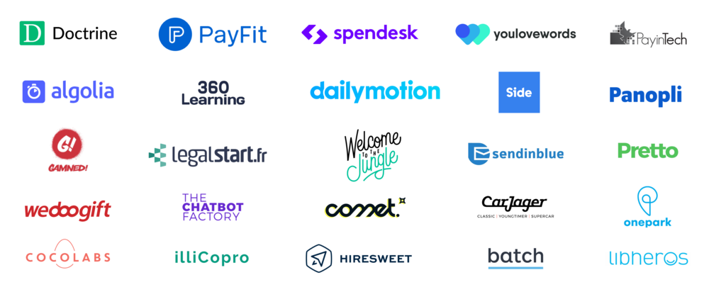

# Mon traqueur d'apprentissage

Un journal de mes compétences en développement Web et mobile, mon apprentissage, mes ressources, mes centres d'intérêt. C'est un moyen de suivre, d'organiser et de partager mes apprentissages.

## Compétences

[done]: https://user-images.githubusercontent.com/29199184/32275438-8385f5c0-bf0b-11e7-9406-42265f71e2bd.png "Done"

| Compétence                                          | 1 Introduction |  2 Bases   |   3 bien   | 4 très bien | 5 confiante | 6 génial |
| :-------------------------------------------------- | :---------------: | :-----------: | :-----------: | :------------: | :------------: | :---------: |
| ** HTML5**                 |   ![done][done]   | ![done][done] | ![done][done] | ![done][done]  | ![done][done]  |             |
| ** CSS3**                   |   ![done][done]   | ![done][done] | ![done][done] | ![done][done]  | ![done][done]  |             |
| ** JavaScript**      |   ![done][done]   | ![done][done] | ![done][done] |                |                |             |
| ** ES6**                     |   ![done][done]   | ![done][done] | ![done][done] |                |                |             |
| ** Reactjs**              |   ![done][done]   | ![done][done] |               |                |
| ** React Native**         |   ![done][done]   | ![done][done] |               |                |                |
| ** Redux**                |   ![done][done]   |               |               |                |                |             |  |
| ** Git**                     |   ![done][done]   | ![done][done] | ![done][done] |                |                |             |  |
| ** GitHub**               |   ![done][done]   | ![done][done] | ![done][done] |
| ** Agile**                 |   ![done][done]   | ![done][done] |               |                |                |             |
| ** Travailler avec des API** |   ![done][done]   | ![done][done] |               |                |                |             |
| ** jQuery**              |   ![done][done]   | ![done][done] |               |                |                |             |
| **Css Grid & Flex-box**                             |   ![done][done]   | ![done][done] | ![done][done] |                |
| **Responsive design**                               |   ![done][done]   | ![done][done] | ![done][done] |                |                |             |
| ** Bootstrap**         |   ![done][done]   | ![done][done] | ![done][done] |                |                |             |
| ** Ligne de commande** |   ![done][done]   | ![done][done] | ![done][done] |                |                |             |
| ** NPM**                     |   ![done][done]   | ![done][done] | ![done][done] |                |                |
| ** NodeJs**                |   ![done][done]   | ![done][done] | ![done][done] |
| ** AJAX**                   |   ![done][done]   | ![done][done] |               |                |                |
| ** Express**              |   ![done][done]   | ![done][done] | ![done][done] |
| ** MongoDB**              |   ![done][done]   | ![done][done] | ![done][done] |
| ** Mongoose**            |   ![done][done]   | ![done][done] | ![done][done] |
| ** Python**               |   ![done][done]   | ![done][done] |
| ** SQL**                     |   ![done][done]   | ![done][done] |

---

## Apprentissage

[//]: # "Status images"
[completed]: https://user-images.githubusercontent.com/29199184/32275438-8385f5c0-bf0b-11e7-9406-42265f71e2bd.png "Completed"
[in progress]: https://user-images.githubusercontent.com/29199184/34462881-7305ddac-ee4d-11e7-9b57-589424820da4.png "In Progress"
[soon]: https://user-images.githubusercontent.com/29199184/34462916-d5c37bd4-ee4d-11e7-9f4a-d57f2243281b.png "Soon"

|         Status          | Année          | Cours                                                                                                                                       |                                         Lien                                         |
| :---------------------: | :------------- | :------------------------------------------------------------------------------------------------------------------------------------------ | :----------------------------------------------------------------------------------: |
| ![Completed][completed] | Juillet 2019   | Formation en ligne React                                                                                                                    |                                      |
| ![Completed][completed] | Juin 2019      | Découvir React Native et créer des apps mobiles                                                                                             |                    |
| ![Completed][completed] | Mai 2019       | Passport, Map View, geolocalisation, Web Sockets, Tchat, Local Storage, Camera d'Expo, Cloudinary, AI et reconnaissance faciale             |                   |
| ![Completed][completed] | Mai 2019       | React Native, Expo, Redux                                                                                                                   |                   |
| ![Completed][completed] | Mai 2019       | ReactJS, BackEnd et microservices, ES6                                                                                                      |                   |
| ![Completed][completed] | Avril 2019     | NodeJS, Express, EJS, Requêtes, Sprite, API, Leaflet, WebServices, MongoDB, Mongoose, MVC, MCD et modélisation des données, Map interactive |                   |
| ![Completed][completed] | Avril 2019     | Fondamentaux JavaScript, Jquery, DOM, HTML, CSS, Flexbox                                                                                    |                   |
| ![Completed][completed] | Mars 2019      | Formation en ligne JavaScript (ES6+), Module débutant                                                                                       |  |
|                         |
| ![Completed][completed] | Mars 2019      | Formation en ligne React                                                                                                                    |                |
| ![Completed][completed] | Mars 2019      | Développement moderne Javascript et ES6, ES7                                                                                                |                              |
| ![Completed][completed] | Février 2019   | Vraiment bien comprendre javascript                                                                                                         |                              |
| ![Completed][completed] | Janvier 2019   | AJAX, JSON, jQuery, MCD(Modèle Conceptuel de Données), MLD(Modèle Logique de Données)                                                       |      |
| ![Completed][completed] | Décembre 2018  | MVC (Modèle-Vue-Contôleur), Héritage, POO, SEO, Modélisation de la BDD, Agile                                                               |      |
| ![Completed][completed] | Décembre 2018  | Gestion de projet, MySQL, Flexbox,                                                                                                          |      |
| ![Completed][completed] | Novembre 2018  | JavaScript ES5, ANGULAR, API, SCRUM                                                                                                         |      |
| ![Completed][completed] | Septembre 2018 | Intégration, HTML5, CSS3, Git, Github, Slack, Vscode, Trello, Intégration, Css Grid, Bootstrap                                              |      |

---

## Mes intérêts

Je suis actuellement intéressée par :

- Tout ce qui concerne la [Data Science](https://jedha.co/) et l'écosystème des startups

---

## Ressources Data Science

- :fr: [Prédire le cours d'une action grâce à la data science](https://jedha.co/blog/2019/09/11/predire-le-cours-dune-action-grace-a-la-data-science/) de [Nirsrine BARKALLAH]
- :us: [Data Science Life Cycle 101 for Dummies like Me](https://towardsdatascience.com/data-science-life-cycle-101-for-dummies-like-me-e66b47ad8d8f) de [Sangeet Moy Das]
- :fr: [Convaincre grâce aux données](https://jedha.co/blog/2018/06/15/convaincre-grace-aux-donnees/) de [KENT AQUEREBURU - DATA SCIENTIST @ SOCIÉTÉ GÉNÉRALE]

---

## Ressources Dév

- :fr: [les meilleurs développeurs web Français sur YouTube...](https://www.ledevweb.fr/) de [Jérémy Mouzin](https://www.javascriptdezero.com/#10)
- :us: [Manuel du developpeur front end 2019](https://frontendmasters.com/books/front-end-handbook/2019/#1) de [Cody Lindley](http://codylindley.com/)
- :fr: [Veille technologique pour les développeurs web](https://thewhale.cc/) de [Gilles Vauvarin](https://thewhale.cc/about)
- [Le meilleur de JavaScript, HTML et CSS](https://bestofjs.org/tags/learning) Une liste organisée des projets open source les plus populaires liés à la plateforme Web et à Node.js.
- [Modern JS Cheatsheet](https://mbeaudru.github.io/modern-js-cheatsheet/) Feuille de triche pour la connaissance de JavaScript que vous rencontrerez fréquemment dans des projets modernes.
- :thumbsup: [The Modern JavaScript Tutorial](http://javascript.info/) Des bases aux sujets avancés avec des explications simples mais détaillées.

---

## Suivre le monde Frontend

- [Focus Frontend](https://frontendfoc.us/) Un récapitulatif hebdomadaire des meilleures nouvelles, articles et tutoriels du front-end. HTML, CSS, WebGL, Canvas, technologie de navigateur, etc.
- [JavaScript Weekly](https://javascriptweekly.com/) Un récapitulatif gratuit, une fois par semaine, des nouvelles et des articles JavaScript.
- [StatusCode Weekly](https://webopsweekly.com/) Un bulletin hebdomadaire couvrant le développement de logiciels, les opérations Web, l'infrastructure, les plates-formes et les performances.
- ## [React Status](https://react.statuscode.com/) Un récapitulatif hebdomadaire des derniers liens et didacticiels React et React Native.

### Liste de contrôle de développement Web

Voici une liste d'objectifs de base à atteindre :

- [x] Ouvrir le terminal de l'ordinateur
- [x] Utilisez un éditeur de texte (Vscode)
- [x] Utilisez des raccourcis clavier
- [ ] Écrire des tests pour votre code
- [x] Aidez un autre développeur Web à résoudre un problème
- [ ] Assistez à un événement sur le développement Web
- [x] Suivre les développeurs que l'on admire sur les médias sociaux
- [ ] Lire un livre sur le codage
- [x] Ouvrir la console de votre navigateur
- [x] Obtenir des données d'une API
- [x] Masquer les clés API du public
- [x] Posez une question sur Stack Overflow
- [x] Code Push vers GitHub
- [ ] Parlez de quelque chose lié au développement web lors d'un événement
- [x] Remplir un entretien technique
- [x] Participer à un hackathon
- [x] Déployer un projet
- [ ] Contribuer à l'open source
- [ ] Soyez payé pour coder
- [x] Lorsque les gens vous demandent ce que vous faites, répondez en disant que vous apprenez le code :)
- [x] Travailler en Pair Programming
- [ ] Apprendre la Data Science
- [ ] Apprendre le langage Python
- [ ] Apprendre SQL
